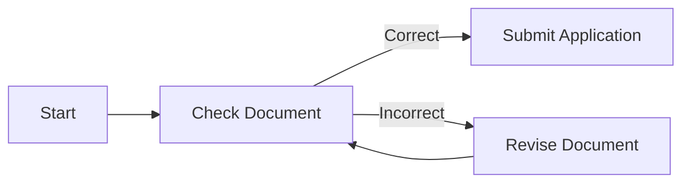
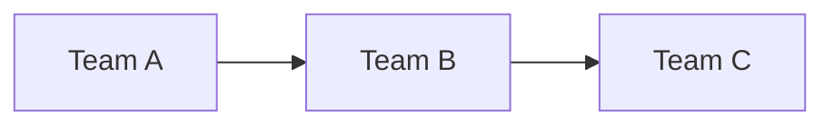

# Aptitude Test Practice (Quick Training)

## Overview
This mini set contains:
- 2 Language Understanding questions
- 2 Quantitative Reasoning questions
- 2 Pattern Reasoning questions
- 2 Diagram Reasoning questions
---

# 1. Language Understanding

## Q1
The rapid development of technology has significantly changed how people communicate. While it allows instant connection across the globe, it may also reduce face-to-face interaction.

What is the main idea of the passage?

A. Technology improves global communication  
B. Technology changes communication with both benefits and drawbacks  
C. Face-to-face interaction is disappearing  
D. Communication is becoming faster  

**Answer: B**

**Explanation:**  
The passage discusses both positive (instant connection) and negative (less face-to-face interaction) effects → balanced view.

---

## Q2
Although the project faced many challenges, the team remained confident and completed it successfully.

What can be inferred?

A. The project failed  
B. The team lacked confidence  
C. The team overcame difficulties  
D. The project had no challenges  

**Answer: C**

**Explanation:**  
"Although" indicates contrast → challenges existed, but success still achieved.

---

# 2. Quantitative Reasoning

## Q3
Find the next number in the sequence:

2, 4, 8, 16, ?

A. 18  
B. 24  
C. 32  
D. 30  

**Answer: C**

**Explanation:**  
Each number is multiplied by 2 → 16 × 2 = 32

---

## Q4
If a product costs $120 after a 20% increase, what was the original price?

A. 80  
B. 90  
C. 100  
D. 110  

**Answer: C**

**Explanation:**  
Let original = x  
x × 1.2 = 120 → x = 100

---

# 3. Pattern Reasoning

## Q5
Pattern: Each step rotates a square 90° clockwise.

What is the next step?

A. Same position  
B. 90° clockwise  
C. 180° rotation  
D. Mirror  

**Answer: B**

**Explanation:**  
Pattern clearly states 90° clockwise rotation each step.

---

## Q6
Pattern: Number of dots increases by 1 each step.

1 dot → 2 dots → 3 dots → ?

A. 3  
B. 4  
C. 5  
D. 6  

**Answer: B**

**Explanation:**  
Simple increment pattern: +1 each step → next is 4

---

# 4. Diagram Reasoning

## Q7

Process diagram:

What happens after an incorrect document?

A. Submit Application  
B. End Process  
C. Revise Document  
D. Approve Document

**Answer: C**

**Explanation:**  
Incorrect → Revise → back to check.

---

## Q8

Relationship diagram:

If Team B delays its work, which team is most directly affected next?

A. Team A  
B. Team C  
C. Both A and C equally first  
D. No team is affected

**Answer: B**

**Explanation:**  
Flow goes B → C, so C is affected next.

---

# Summary Tips
- Language: Focus on keywords (but, although, however)
- Math: Look for simple patterns (×2, +1)
- Pattern: Check rotation, symmetry, count changes
- Diagram: Follow arrows carefully

